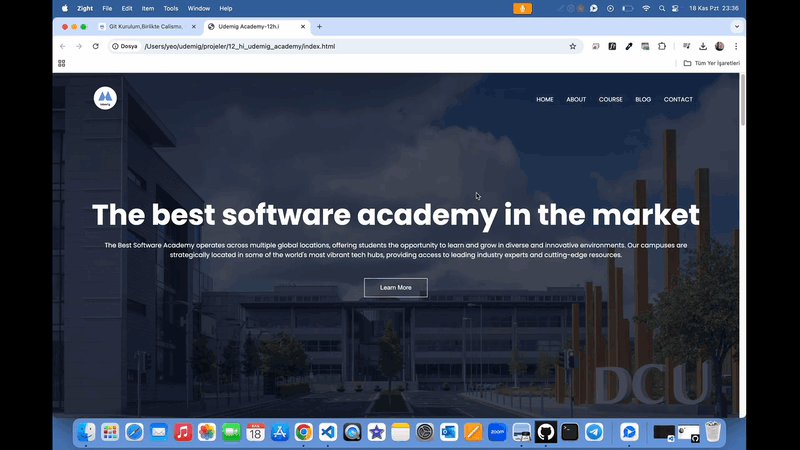

# Udemig Academy Site Arayüzü 💻

<li>Bu proje HTML5,CSS3 ile oluşturulmuş Yazılım Eğitimi site arayüzü içerir.</li>
<li>Zengin içeriği,kolay ve modern yapısıyla yazılım eğitimi almak isteyenlerin beğenisine sunulmuştur.</li>
<li>Blog menüsü,müşteri yorumları,sosyal medya hesapları ile akıllardaki soruları çözüm sunar.</li>
<li>Ayrıca duyarlı tasarımı ile telefon,tablet,bilgisayar üzerinden kolay erişim olanağı sunar.</li>

# Kullanılan Teknolojiler 🎨

<li>HTML5</li>
<li>CSS3</li>
<li>Responsive Design</li>

# Ekran Görüntüsü 🎥
      

# İletişim 📩
yunusemreoral@hotmail.com.tr

